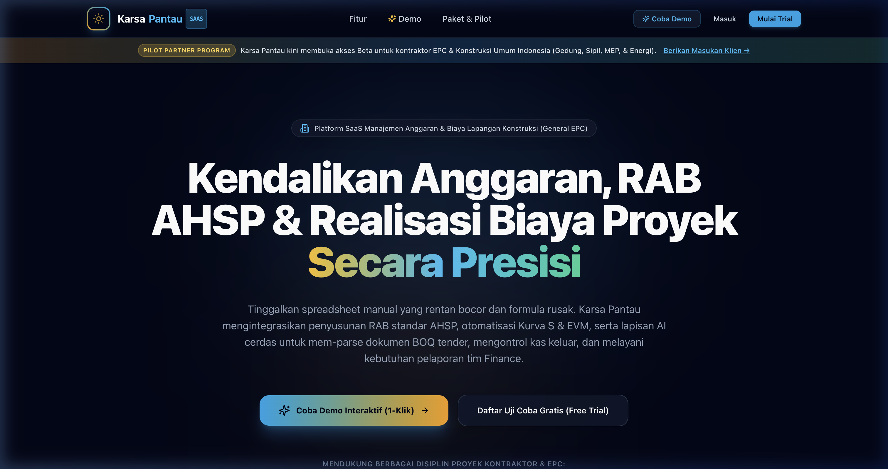
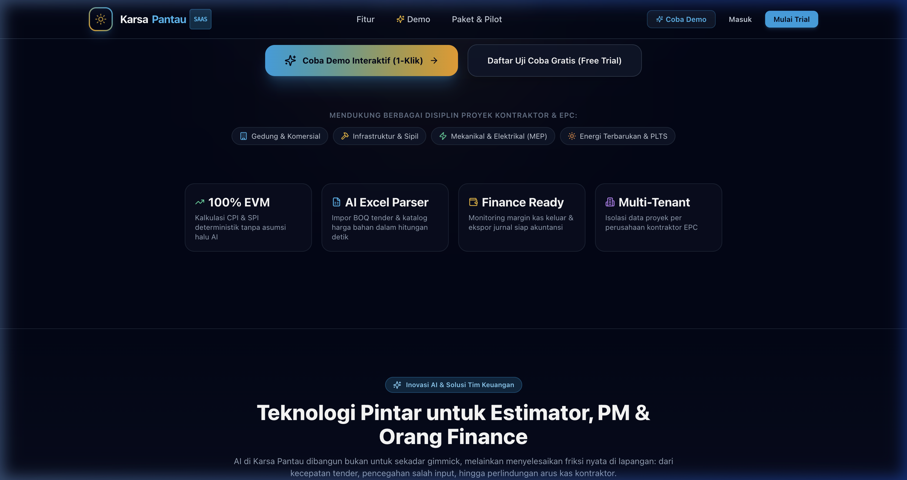
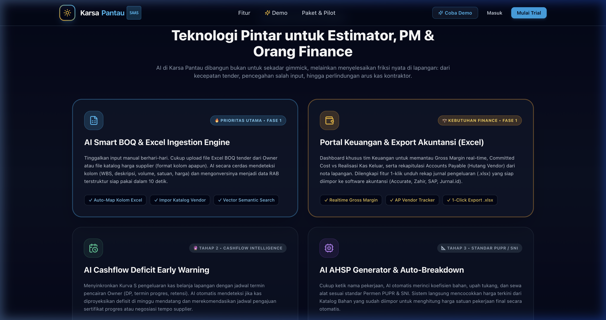
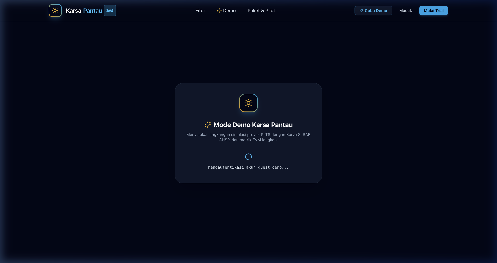
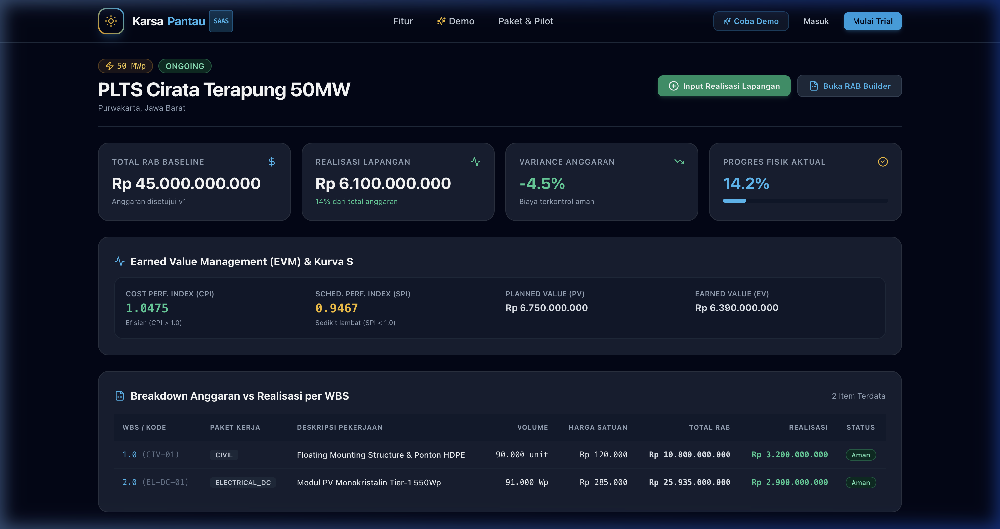
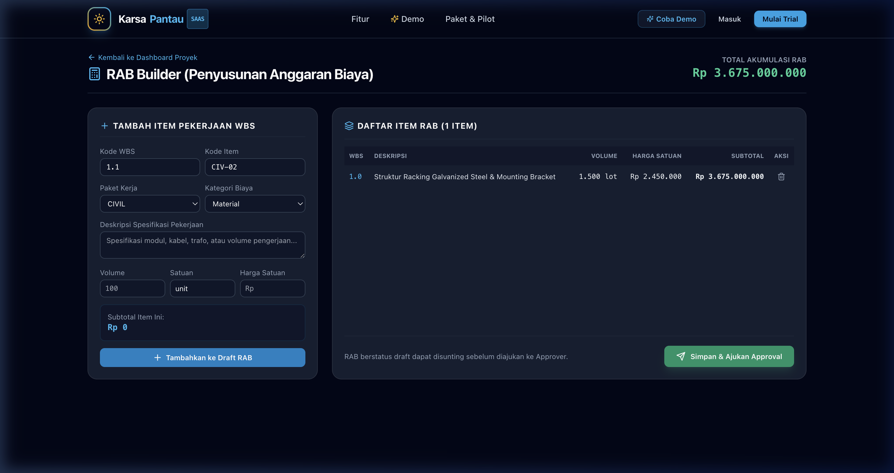
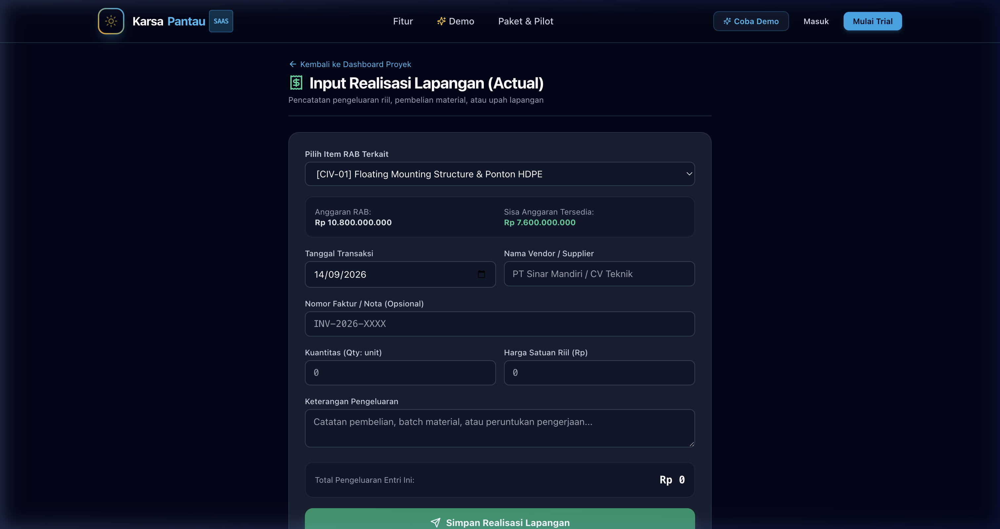

# 📖 Buku Panduan Pengguna Karsa Pantau (User Guide)
### Platform Manajemen Anggaran, RAB AHSP & Monitoring Realisasi Proyek Konstruksi (General EPC)

Versi: 1.0 (General Construction & EPC Edition)  
URL Aplikasi: [https://karsapantau.com](https://karsapantau.com)  
AI Gateway: [https://ai.karsapantau.com](https://ai.karsapantau.com)

---

## Daftar Isi
1. [Tentang Karsa Pantau](#1-tentang-karsa-pantau)
2. [Alur Kerja Utama (Core Workflow)](#2-alur-kerja-utama-core-workflow)
3. [Panduan Eksplorasi Mode Demo 1-Klik](#3-panduan-eksplorasi-mode-demo-1-klik)
4. [Panduan Halaman & Fitur Aplikasi](#4-panduan-halaman--fitur-aplikasi)
   - [4.1 Landing Page & Portofolio (`/` & `/projects`)](#41-landing-page--portofolio--projects)
   - [4.2 Dashboard Monitoring EVM & Kurva S (`/projects/[id]`)](#42-dashboard-monitoring-evm--kurva-s-projectsid)
   - [4.3 RAB & AHSP Builder (`/projects/[id]/rab/new`)](#43-rab--ahsp-builder-projectsidrabnew)
   - [4.4 Input Realisasi Lapangan & Budget Guardrail (`/projects/[id]/actual/new`)](#44-input-realisasi-lapangan--budget-guardrail-projectsidactualnew)
   - [4.5 Approval Center (`/approvals`)](#45-approval-center-approvals)
   - [4.6 Portal Keuangan & Ekspor Akuntansi](#46-portal-keuangan--ekspor-akuntansi)
5. [Panduan Berdasarkan Peran (Role-Based Guide)](#5-panduan-berdasarkan-peran-role-based-guide)
   - [Estimator / Tender Engineer](#estimator--tender-engineer)
   - [Supervisor Lapangan / Site Engineer / Mandor](#supervisor-lapangan--site-engineer--mandor)
   - [Project Manager (PM) & Direksi](#project-manager-pm--direksi)
   - [Finance & Accounting](#finance--accounting)
6. [Panduan Penggunaan Fitur AI (9Router)](#6-panduan-penggunaan-fitur-ai-9router)
7. [Tanya Jawab & Troubleshooting (FAQ)](#7-tanya-jawab--troubleshooting-faq)

---

## 1. Tentang Karsa Pantau

**Karsa Pantau** adalah sistem informasi manajemen proyek berbasis web (PWA) yang dirancang untuk kontraktor umum, spesialis sipil, mekanikal elektrikal (MEP), infrastruktur, dan energi terbarukan. 

### Masalah yang Diselesaikan:
- **Blindspot Biaya Lapangan**: Kontraktor sering kali baru menyadari pembengkakan biaya saat proyek sudah selesai atau kas menipis.
- **RAB dan Realisasi yang Terpisah**: File RAB Excel tersimpan di kantor pusat, sementara belanja material dan upah harian dicatat manual di buku mandor.
- **Perhitungan EVM yang Rumit**: Analisis *Earned Value Management* (CPI, SPI, EAC) jarang dihitung berkala karena memakan waktu.

### Solusi Karsa Pantau:
- **Penyusunan RAB Terstruktur**: Menggunakan hierarki Work Breakdown Structure (WBS) dan komponen AHSP (Bahan, Upah, Alat, Subkon).
- **Pencatatan Realisasi Lapangan Cepat**: Mandor atau site engineer dapat menginput belanja langsung dari HP, lengkap dengan nomor nota, vendor, dan foto kuitansi.
- **Budget Guardrail Otomatis**: Sistem menolak atau memberi peringatan dini seketika jika pengeluaran aktual melebihi sisa pagu anggaran item RAB terkait.
- **Monitoring Deterministik EVM & Kurva S**: Grafik rencana vs realisasi dan indeks performa (CPI & SPI) terhitung otomatis di backend setiap kali ada transaksi baru.
- **Lapisan Kecerdasan AI via 9Router**: Mendeteksi anomali biaya, memprediksi proyeksi akhir (EAC), serta menyediakan asisten cerdas untuk tanya jawab proyek.

---

## 2. Alur Kerja Utama (Core Workflow)

```
[1. Buat Proyek] ➡️ [2. Susun RAB (Draft)] ➡️ [3. Review & Approval PM]
                                                        ⬇️
[6. Monitoring EVM & Kurva S] ⬅️ [5. Budget Guardrail] ⬅️ [4. Input Realisasi Lapangan]
            ⬇️
[7. Deteksi Anomali AI & Rekap Finance]
```

1. **Pembuatan Baseline Proyek**: Tentukan nilai kontrak, jadwal pelaksanaan, lokasi, dan tim proyek.
2. **Penyusunan RAB (Draft)**: Masukkan rincian paket kerja, volume, satuan, dan harga satuan pekerjaan.
3. **Persetujuan (Approval)**: Project Manager meninjau dan mengesahkan status RAB menjadi `approved`.
   > **Aturan Penting**: Transaksi realisasi lapangan **hanya dapat dicatat** pada RAB yang berstatus `approved`. RAB yang masih `draft` atau `submitted` terkunci dari pencatatan aktual.
4. **Input Realisasi Lapangan**: Tim proyek mencatat belanja harian terhadap item RAB yang relevan.
5. **Validasi Guardrail**: Sistem memeriksa sisa kuota anggaran item secara *real-time*.
6. **Kalkulasi Deterministik**: Backend memperbarui angka PV, EV, AC, CPI, dan SPI.
7. **Wawasan AI & Finance**: Sistem AI memberikan peringatan jika terjadi deviasi di atas 10% dan menyajikan ringkasan untuk laporan akuntansi.

---

## 3. Panduan Eksplorasi Mode Demo 1-Klik

Bagi pengguna baru atau calon klien yang ingin langsung menguji sistem tanpa melakukan pendaftaran akun:

1. Kunjungi [https://karsapantau.com](https://karsapantau.com).
2. Klik tombol **"Buka Demo Interaktif"** pada banner atas atau navigasi.
3. Anda akan langsung diarahkan ke halaman `/demo` yang mengarahkan ke proyek contoh berskala nyata:
   - Proyek contoh: *PLTS Cirata Terapung 50MW / EPC Infrastruktur*.
   - Data aktif mencakup: Anggaran Rp 45 Milyar, realisasi belanja aktual, status EVM, dan item RAB aktif.
4. Anda dapat mencoba langsung:
   - Menjelajahi metrik EVM dan grafik Kurva S.
   - Mengklik **"Input Realisasi Lapangan"** untuk menguji form pencatatan belanja.
   - Membuka **"RAB Builder"** untuk melihat susunan struktur WBS pekerjaan.

---

## 4. Panduan Halaman & Fitur Aplikasi

### 4.1 Landing Page & Portofolio (`/` & `/projects`)



- **Halaman Depan (`/`)**:
  - Menyajikan proposisi nilai untuk 4 pilar industri: **Gedung & Komersial**, **Infrastruktur & Sipil**, **Mekanikal Elektrikal (MEP)**, dan **Energi & Utilitas**.



  - Menampilkan Roadmap Inovasi Fitur AI & Finansial:
    1. *AI Smart BOQ & Ingestion Excel* (Auto-generate RAB dari dokumen tender).
    2. *Portal Keuangan & Ekspor Akuntansi* (Gross Margin, AP Vendor, ekspor ke SAP/Accurate).
    3. *AI Cashflow Deficit Early Warning* (Prediksi defisit kas sebelum uang habis).
    4. *AI AHSP Generator* (Breakdown koefisien SNI / Permen PUPR).



  - Formulir masukan calon klien untuk mengajukan kebutuhan kustom proyek.
- **Portofolio Proyek (`/projects`)**:
  - Daftar seluruh proyek aktif, masa perencanaan, dan proyek selesai.
  - Kartu ringkasan memuat: Nilai Kontrak, Persentase Realisasi, Status Fisik, dan Indikator Deviasi Biaya (Warna hijau untuk aman, merah untuk overbudget).

---

### 4.2 Dashboard Monitoring EVM & Kurva S (`/projects/[id]`)

Halaman utama bagi Project Manager dan Manajemen untuk memantau kesehatan finansial proyek.



#### Elemen Kunci:
1. **Header Proyek**: Menampilkan nama proyek, lokasi, kapasitas/skala, status proyek, serta tombol navigasi cepat (*Input Realisasi* & *Buka RAB Builder*).
2. **4 Kartu Metrik Utama**:
   - **Total RAB Baseline**: Total anggaran yang telah disahkan.
   - **Realisasi Lapangan**: Total dana kas yang telah keluar tercatat di lapangan.
   - **Variance Anggaran**: Selisih persentase antara anggaran rencana dengan belanja aktual.
   - **Progres Fisik Aktual**: Persentase kemajuan fisik lapangan dengan indikator progress bar visual.
3. **Panel Earned Value Management (EVM) & Kurva S**:
   - **CPI (Cost Performance Index)**:
     - Formula: $\text{CPI} = \frac{\text{EV}}{\text{AC}}$
     - $\text{CPI} \ge 1.0$: Belanja efisien (di bawah anggaran).
     - $\text{CPI} < 1.0$: Peringatan pembengkakan biaya (*overbudget*).
   - **SPI (Schedule Performance Index)**:
     - Formula: $\text{SPI} = \frac{\text{EV}}{\text{PV}}$
     - $\text{SPI} \ge 1.0$: Progres proyek sesuai atau lebih cepat dari jadwal.
     - $\text{SPI} < 1.0$: Proyek mengalami keterlambatan (*behind schedule*).
   - **Planned Value (PV)**: Nilai pekerjaan yang dijadwalkan selesai pada periode ini.
   - **Earned Value (EV)**: Nilai pekerjaan yang secara aktual telah selesai dikerjakan.



4. **Tabel Breakdown WBS (Work Breakdown Structure)**:
   - Rincian per kode WBS, paket kerja, deskripsi pekerjaan, volume, harga satuan, pagu total RAB, total realisasi, dan status kepatuhan anggaran.

---

### 4.3 RAB & AHSP Builder (`/projects/[id]/rab/new`)

Digunakan oleh Estimator untuk merancang anggaran biaya proyek secara terperinci.



#### Langkah Penggunaan:
1. Masukkan **Kode WBS** (contoh: `1.0`, `1.1`, `2.0`) untuk menentukan hierarki pekerjaan.
2. Tentukan **Kode Item** (contoh: `CIV-01`, `MEP-02`, `STR-05`).
3. Pilih **Paket Kerja**:
   - `CIVIL` (Pekerjaan Tanah, Struktur, Beton)
   - `ELECTRICAL_DC` / `ELECTRICAL_AC` (Kelistrikan, Panel, Trafo, Perkabelan)
   - `MECHANICAL` (Piping, HVAC, Pompa, Ducting)
   - `LOGISTICS` (Transportasi material berat, mobilisasi alat)
   - `SERVICES` (Jasa engineering, pengujian komisioning, perizinan)
4. Tentukan **Kategori Biaya**:
   - `MATERIAL` (Bahan mentah & perlengkapan pabrikasi)
   - `LABOR` (Upah tukang, mandor, pekerja harian)
   - `EQUIPMENT` (Sewa alat berat, genset, crane)
   - `SUBCON` (Paket pekerjaan borongan pihak ketiga)
   - `OPERATIONAL` (Biaya operasional kantor proyek/mess)
5. Masukkan **Volume**, **Satuan** (`m3`, `m2`, `kg`, `lot`, `titik`, dll), dan **Harga Satuan (IDR)**.
6. Sistem akan mengkalkulasi subtotal secara otomatis.
7. Klik **"Tambah ke Draft RAB"**.
8. Setelah seluruh item selesai disusun, klik **"Ajukan untuk Persetujuan (Submit Approval)"**.

---

### 4.4 Input Realisasi Lapangan & Budget Guardrail (`/projects/[id]/actual/new`)

Digunakan oleh Mandor, Site Engineer, atau Logistik Lapangan untuk mencatat pengeluaran harian.



#### Fitur Utama:
1. **Pemilihan Item RAB**: Pengguna memilih item pekerjaan spesifik yang sedang dibelanjakan.
2. **Informasi Transaksi**:
   - **Tanggal Realisasi**: Tanggal kuitansi atau transaksi berlangsung.
   - **Nama Vendor / Toko / Mandor**: Pihak penerima pembayaran.
   - **Nomor Kuitansi / Faktur / Nota**: Nomor referensi bukti fisik transaksi.
   - **Kuantitas & Harga Satuan**: Jumlah barang atau orang-hari yang dibayarkan.
3. **Live Budget Guardrail**:
   - Setiap kali angka kuantitas atau harga satuan diisi, sistem menghitung:
     $$\text{Total Transaksi} = \text{Qty} \times \text{Harga Satuan}$$
     $$\text{Proyeksi Realisasi} = \text{Realisasi Berjalan} + \text{Total Transaksi}$$
   - **Peringatan Dini**: Jika nilai proyeksi melebihi sisa plafon anggaran item RAB, kotak peringatan merah menyala:
     > ⚠️ **Peringatan Pagu**: Belanja ini melebihi sisa anggaran item sebesar Rp X. Pengajuan memerlukan otorisasi manajer proyek!
4. **Dukungan Mode Offline (PWA)**:
   - Apabila koneksi internet di lapangan terputus, form tetap dapat disimpan. Data akan otomatis masuk ke antrean lokal (IndexedDB) dan dikirim ke server saat koneksi internet pulih.

---

### 4.5 Approval Center (`/approvals`)

Halaman khusus bagi Project Manager atau Direktur Operasional untuk menjaga tata kelola proyek:
- Meninjau draft RAB yang baru diajukan oleh Estimator.
- Memeriksa selisih harga terhadap baseline pasar.
- Memberikan status **Approved** (disahkan) atau **Rejected** (dikembalikan dengan catatan revisi).
- Memverifikasi pengeluaran aktual lapangan yang melampaui ambang batas deviasi biaya.

---

### 4.6 Portal Keuangan & Ekspor Akuntansi

Fitur khusus untuk departemen keuangan perusahaan kontraktor:
- **Monitoring Gross Margin**: Membandingkan total nilai penagihan termin ke Owner dengan total belanja riil lapangan.
- **Rekapitulasi Hutang Vendor (Accounts Payable)**: Memantau nota tempo material yang belum terbayar.
- **Ekspor Jurnal (.xlsx / CSV)**: Format tabel yang siap diimpor langsung ke software akuntansi seperti SAP, Accurate, Zahir, atau Jurnal.id tanpa perlu pengetikan ulang.

---

## 5. Panduan Berdasarkan Peran (Role-Based Guide)

| Peran Pengguna | Tugas & Tanggung Jawab Utama di Karsa Pantau | Halaman Akses Kunci |
|---|---|---|
| **Estimator / Tender Engineer** | - Memetakan item BOQ dari Owner ke dalam WBS.<br>- Memasukkan koefisien analisa harga satuan (AHSP).<br>- Menggunakan Semantic Search AI untuk cek histori harga.<br>- Mengajukan draft RAB ke PM. | `/projects/[id]/rab/new`<br>`/api/v1/ai/semantic-search` |
| **Supervisor Lapangan / Mandor** | - Mencatat pembelian material lokal atau sewa alat.<br>- Mencatat upah harian pekerja proyek.<br>- Mengunggah foto nota/bon belanja.<br>- Bekerja dalam mode offline saat di lokasi minim sinyal. | `/projects/[id]/actual/new` |
| **Project Manager (PM)** | - Memeriksa dan menyetujui draft RAB.<br>- Memantau pergerakan grafik Kurva S tiap minggu.<br>- Membaca rekomendasi mitigasi pada kartu anomali biaya AI.<br>- Memastikan indeks CPI & SPI tetap berada di atas 1.0. | `/projects/[id]`<br>`/approvals` |
| **Finance & Akuntansi** | - Memverifikasi nota belanja terhadap rekening koran proyek.<br>- Memastikan tidak ada pengeluaran tanpa pos RAB.<br>- Mengunduh rekapan transaksi bulanan untuk pelaporan pajak & laporan laba rugi proyek. | `/projects/[id]`<br>`/pricing` (Portal Keuangan) |

---

## 6. Panduan Penggunaan Fitur AI (9Router)

Karsa Pantau terintegrasi dengan **9Router AI Gateway** (`https://ai.karsapantau.com`) yang menghubungkan model kecerdasan buatan terdepan dengan keamanan tingkat industri.

### Aturan Emas Integrasi AI:
1. **Kalkulasi Finansial Selalu Deterministik**: AI tidak pernah menghitung saldo kas atau rumus EVM secara mandiri. Semua rumus matematis dihitung 100% oleh backend NestJS. AI bertugas menyusun **narasi wawasan bisnis, diagnosis masalah, dan saran mitigasi**.
2. **Audit Trail Lengkap**: Semua rekomendasi, peringatan anomali, dan hasil analisis AI tersimpan di tabel database `ai_insights` untuk kebutuhan audit formal.
3. **Fallback Cerdas**: Jika koneksi AI sedang lambat atau offline, aplikasi tetap berfungsi normal dengan pencarian teks standar tanpa menghambat operasional lapangan.

### Fitur AI yang Tersedia:
- **Pencarian Semantik Harga (Semantic Search)**:
  - Cari riwayat harga pengadaan lampau menggunakan bahasa alami (contoh: *"kabel tegangan menengah tahan air"*). Sistem pgvector akan mencocokkan kemiripan vektor dan menampilkan referensi harga terbaik.
- **Deteksi Anomali Biaya Otomatis**:
  - Sistem memeriksa item yang mengalami deviasi biaya di atas ambang batas (default 10%) dan merangkum akar masalahnya ke dalam dashboard.
- **Chat Asisten Proyek (Streaming RAG via SSE)**:
  - Tanyakan kondisi proyek secara langsung, misalnya: *"Berapa perkiraan biaya akhir (EAC) proyek ini jika tren CPI sekarang berlanjut?"*

---

## 7. Tanya Jawab & Troubleshooting (FAQ)

### Q1: Mengapa saya tidak bisa menginput realisasi lapangan pada proyek baru?
> **Jawaban**: Pastikan RAB proyek telah diajukan dan disetujui (`status: approved`). Sesuai tata kelola finansial konstruksi, dilarang mengeluarkan biaya pada proyek yang belum memiliki pagu anggaran sah.

### Q2: Apakah aplikasi bisa dibuka di smartphone tanpa menginstal dari Play Store/App Store?
> **Jawaban**: Ya. Karsa Pantau adalah **Progressive Web App (PWA)**. Cukup buka [https://karsapantau.com](https://karsapantau.com) di Google Chrome (Android) atau Safari (iOS), lalu pilih menu browser **"Add to Home Screen"** (Tambahkan ke Layar Utama).

### Q3: Bagaimana jika koneksi internet terputus saat menginput nota belanja di lokasi proyek?
> **Jawaban**: Aplikasi akan tetap menerima input data Anda dan menyimpannya di memori lokal perangkat. Begitu perangkat terhubung kembali ke jaringan internet, antrean data akan tersinkronisasi otomatis ke server.

### Q4: Apakah data proyek kami aman dan tidak digunakan untuk melatih model AI publik?
> **Jawaban**: Sangat aman. Semua lalu lintas AI dikontrol melalui gateway privat 9Router kami sendiri (`ai.karsapantau.com`) dengan kunci enkripsi aman. Data proyek Anda tidak pernah dibagikan ke pihak ketiga untuk pelatihan model publik.

---
*Dokumen ini merupakan bagian dari repositori resmi Karsa Pantau. Untuk pertanyaan teknis lebih lanjut, hubungi tim pengembang.*
